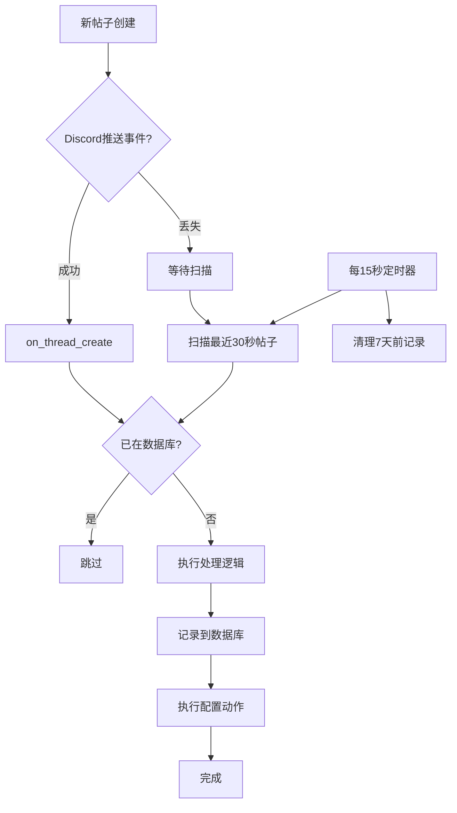

# 帖子监听遗漏扫描方案

## 背景问题
Discord 服务器波动可能导致 `on_thread_create` 事件丢失，需要补充机制确保不遗漏任何新帖子。

## 解决方案：双保险机制

### 1. 主要机制（现有）
- **事件监听**：`on_thread_create` 实时响应
- **优点**：响应迅速，实时性强
- **缺点**：网络不稳定时可能丢失事件

### 2. 补充机制（新增）
- **定时扫描**：每15秒执行一次遗漏检查
- **扫描范围**：最近30秒内创建的帖子
- **去重策略**：通过数据库记录避免重复处理

## 技术实现

### 数据库改动

#### 新增处理记录表
```sql
CREATE TABLE IF NOT EXISTS forum_posts_processed (
    thread_id TEXT PRIMARY KEY,
    guild_id TEXT NOT NULL,
    forum_channel_id TEXT NOT NULL,
    thread_created_at TEXT NOT NULL,  -- 帖子创建时间
    processed_at TEXT NOT NULL,       -- 处理时间
    processed_by TEXT NOT NULL,       -- 'event' 或 'scan'
    actions_taken TEXT                -- JSON记录执行了哪些动作
)

-- 索引优化查询性能
CREATE INDEX IF NOT EXISTS idx_forum_posts_guild_channel 
    ON forum_posts_processed (guild_id, forum_channel_id, thread_created_at)
CREATE INDEX IF NOT EXISTS idx_forum_posts_created 
    ON forum_posts_processed (thread_created_at)
```

### 核心逻辑改动

#### 1. 修改现有事件处理
在 `on_thread_create` 和 `_process_actions` 中添加记录：
- 处理前检查是否已处理
- 处理后记录到 `forum_posts_processed` 表

#### 2. 新增定时扫描任务
```python
@tasks.loop(seconds=15)
async def scan_missed_posts(self):
    """扫描可能遗漏的帖子"""
    # 1. 获取所有启用监控的论坛频道
    # 2. 对每个频道：
    #    - 获取最近30秒的帖子
    #    - 检查是否在处理记录表中
    #    - 未处理的执行补充处理
    # 3. 清理7天前的旧记录
```

#### 3. 并发安全处理
使用数据库事务确保同一帖子不会被重复处理：
```python
async def record_processed_safe(thread_id: str, ...):
    """安全记录处理，返回是否成功插入"""
    try:
        # INSERT OR IGNORE 确保唯一性
        result = await db_manager.execute(
            "INSERT OR IGNORE INTO forum_posts_processed ..."
        )
        return result > 0  # 返回是否真的插入了
    except:
        return False
```

## 实现流程图



## 实现步骤清单

### 第一阶段：数据库准备
- [ ] 在 `core/database.py` 添加 `forum_posts_processed` 表
- [ ] 添加必要的索引
- [ ] 实现清理旧记录的方法

### 第二阶段：修改现有逻辑
- [ ] 修改 `on_thread_create` 添加去重检查
- [ ] 修改 `_process_actions` 记录处理结果
- [ ] 添加并发安全的记录方法

### 第三阶段：实现扫描机制
- [ ] 实现 `scan_missed_posts` 定时任务
- [ ] 实现获取频道最近帖子的方法
- [ ] 实现补充处理逻辑

### 第四阶段：测试和优化
- [ ] 测试正常事件处理
- [ ] 测试遗漏扫描补充
- [ ] 测试并发去重
- [ ] 性能调优

## 配置参数

```python
# 可配置的参数（可放在 constants.py）
FORUM_SCAN_INTERVAL = 15  # 扫描间隔（秒）
FORUM_SCAN_WINDOW = 30    # 扫描时间窗口（秒）
FORUM_RECORD_RETENTION = 7  # 记录保留天数
```

## 错误处理

1. **扫描失败**：记录日志，下次继续
2. **处理失败**：记录失败原因，避免重复尝试
3. **数据库错误**：降级到仅事件模式
4. **API限制**：实现速率控制

## 监控指标

建议记录以下指标用于监控：
- 事件处理数量 vs 扫描补充数量
- 遗漏率 = 扫描补充 / 总处理
- 平均处理延迟
- 扫描任务执行时长

## 注意事项

1. **性能影响**：每15秒扫描可能对大型服务器有影响，后续可考虑优化
2. **存储空间**：处理记录表会持续增长，需要定期清理
3. **并发处理**：使用数据库约束确保不重复
4. **降级策略**：扫描失败时不影响事件处理

## 后续优化建议

1. **动态调整扫描频率**：根据遗漏率自动调整
2. **分批扫描**：多频道时分批处理
3. **缓存优化**：缓存最近处理的帖子ID
4. **监控面板**：添加统计信息到管理面板