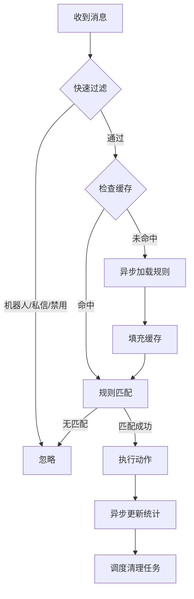
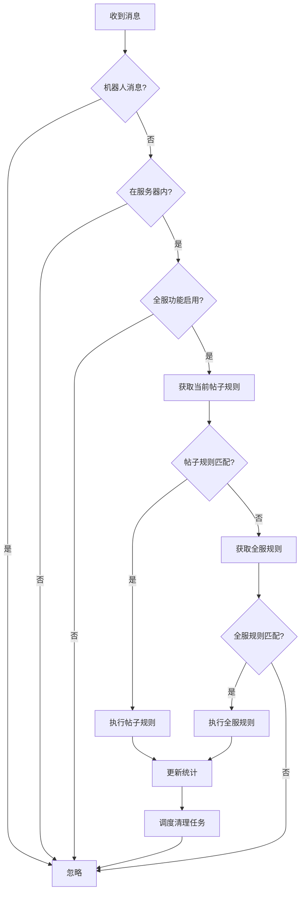
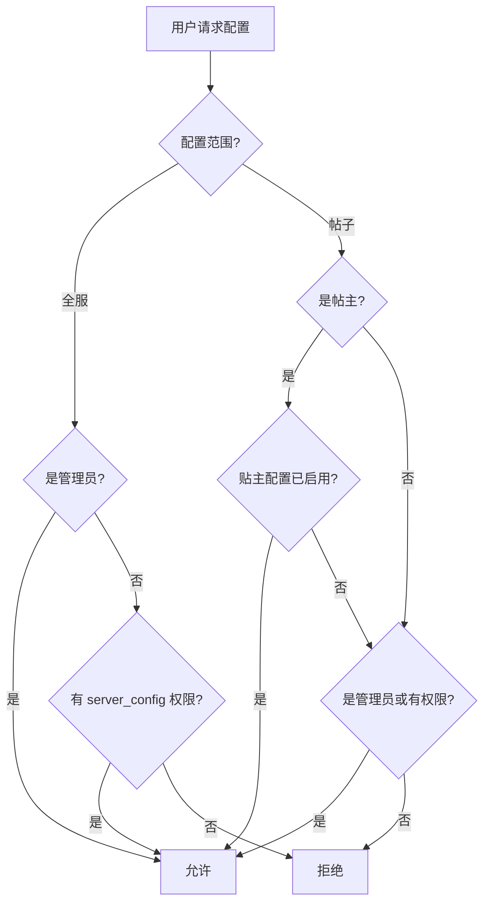

# 帖子自定义命令系统设计文档

> **状态**: ✅ 已完成实现
> **版本**: 2.0.0
> **更新日期**: 2024-12
> **更新说明**: 简化命令结构，采用面板化配置

## 快速开始

### 命令概览

本系统仅使用 **3个面板命令**，所有配置通过可视化面板完成：

| 命令 | 说明 | 权限 |
|------|------|------|
| `/扫描监听提醒 状态` | 查看功能开关状态 | 所有人 |
| `/扫描监听提醒 配置` | 服务器配置面板 | 管理员/特殊权限 |
| `/扫描监听提醒 帖子配置` | 帖子配置面板（需在帖子内使用） | 帖主/管理员 |

### 初始化回顶功能

1. 使用 `/扫描监听提醒 配置` 打开服务器配置面板
2. 点击「初始化回顶规则」按钮

这会创建默认的回顶规则，触发词为 `/回顶`、`／回顶`、`回顶`。

### 添加自定义规则

1. 使用 `/扫描监听提醒 配置` 打开服务器配置面板
2. 点击「添加规则」按钮
3. 在弹出的表单中填写：
   - 触发词（多个用逗号分隔）
   - 匹配模式（exact/prefix/contains/regex）
   - 动作类型（reply/go_to_top/react）
   - 回复内容（可选）
   - 删除延迟（可选）

---

## 0. 性能设计（高并发场景）

> **重要**: 本系统需支持20万+用户社区，上千帖子并发使用，必须确保高性能和稳定性。

### 0.1 缓存策略

> **硬件环境**：2核2G VPS（需与其他服务共存），采用保守的资源配置。

#### 缓存架构图

```
┌─────────────────────────────────────────────────────────────┐
│                    消息处理请求                               │
└─────────────────────────────────────────────────────────────┘
                              ↓
┌─────────────────────────────────────────────────────────────┐
│  L1: 内存缓存 - Python dict + TTL + LRU淘汰                 │
│  ┌─────────────────────────────────────────────────────────┐│
│  │ 全服规则缓存                                             ││
│  │ Key: guild_id   Value: List of ThreadCommandRule        ││
│  │ TTL: 3600秒-1小时   最大: 10个服务器                      ││
│  ├─────────────────────────────────────────────────────────┤│
│  │ 帖子规则缓存                                             ││
│  │ Key: thread_id  Value: List of ThreadCommandRule        ││
│  │ TTL: 1800秒-30分钟  最大: 200个帖子                       ││
│  ├─────────────────────────────────────────────────────────┤│
│  │ 服务器配置缓存                                           ││
│  │ Key: guild_id   Value: ThreadCommandServerConfig        ││
│  │ TTL: 3600秒-1小时                                        ││
│  └─────────────────────────────────────────────────────────┘│
│  缓存命中 - 直接返回                                         │
│  缓存未命中 - 查询数据库 - 填充缓存                           │
└─────────────────────────────────────────────────────────────┘
                              ↓ 未命中时
┌─────────────────────────────────────────────────────────────┐
│  L2: SQLite 数据库                                          │
│  - thread_command_rules 表                                  │
│  - thread_command_server_config 表                          │
└─────────────────────────────────────────────────────────────┘
```

#### 缓存配置（适配2核2G VPS）

```python
CACHE_CONFIG = {
    # 超长TTL（正常情况下由修改操作主动刷新，TTL仅作兜底）
    'server_rules_ttl': 3600,      # 全服规则缓存1小时
    'thread_rules_ttl': 1800,      # 帖子规则缓存30分钟
    'server_config_ttl': 3600,     # 服务器配置缓存1小时
    
    # 容量限制（适配2G内存环境）
    'max_cached_threads': 200,     # 最多缓存200个帖子的规则
    'max_cached_guilds': 10,       # 最多缓存10个服务器的规则
}
```

#### Write-through Cache 策略（修改即刷新）

核心思想：规则修改时**主动刷新缓存**，无需等待TTL过期。

```python
class RuleCacheManager:
    """规则缓存管理器 - Write-through Cache 策略"""
    
    def __init__(self):
        self.server_rules_ttl = 3600      # 1小时（兜底）
        self.thread_rules_ttl = 1800      # 30分钟（兜底）
        self.server_config_ttl = 3600     # 1小时（兜底）
        
        self._server_rules = {}  # guild_id: rules, expire_time
        self._thread_rules = {}  # thread_id: rules, expire_time
        self._server_config = {} # guild_id: config, expire_time
    
    # ========== 读取-带缓存 ==========
    async def get_server_rules(self, guild_id: str) -> list:
        """获取全服规则，优先读缓存"""
        cached = self._server_rules.get(guild_id)
        if cached and time.time() < cached[1]:
            return cached[0]  # 缓存命中
        
        # 缓存未命中，查数据库
        rules = await self._load_from_db('server', guild_id)
        self._server_rules[guild_id] = (rules, time.time() + self.server_rules_ttl)
        return rules
    
    async def get_thread_rules(self, thread_id: str) -> list:
        """获取帖子规则，优先读缓存"""
        cached = self._thread_rules.get(thread_id)
        if cached and time.time() < cached[1]:
            return cached[0]
        
        rules = await self._load_from_db('thread', thread_id)
        self._thread_rules[thread_id] = (rules, time.time() + self.thread_rules_ttl)
        return rules
    
    # ========== 写入-刷新缓存 ==========
    async def add_rule(self, rule):
        """添加规则，写入数据库并刷新缓存"""
        await db_manager.insert_rule(rule)
        
        if rule.scope == 'server':
            await self._refresh_server_rules(rule.guild_id)
        else:
            await self._refresh_thread_rules(rule.thread_id)
    
    async def update_rule(self, rule_id: int, **updates):
        """更新规则，更新数据库并刷新缓存"""
        rule = await db_manager.update_rule(rule_id, **updates)
        
        if rule.scope == 'server':
            await self._refresh_server_rules(rule.guild_id)
        else:
            await self._refresh_thread_rules(rule.thread_id)
    
    async def delete_rule(self, rule_id: int):
        """删除规则，删除数据库记录并刷新缓存"""
        rule = await db_manager.get_rule(rule_id)
        await db_manager.delete_rule(rule_id)
        
        if rule.scope == 'server':
            await self._refresh_server_rules(rule.guild_id)
        else:
            await self._refresh_thread_rules(rule.thread_id)
    
    # ========== 主动刷新缓存 ==========
    async def _refresh_server_rules(self, guild_id: str):
        """主动刷新服务器规则缓存"""
        rules = await self._load_from_db('server', guild_id)
        self._server_rules[guild_id] = (rules, time.time() + self.server_rules_ttl)
    
    async def _refresh_thread_rules(self, thread_id: str):
        """主动刷新帖子规则缓存"""
        rules = await self._load_from_db('thread', thread_id)
        self._thread_rules[thread_id] = (rules, time.time() + self.thread_rules_ttl)
```

#### 策略优势对比

| 特性 | TTL短方案 | TTL长方案 | 修改即刷新方案 |
|-----|---------|---------|--------------|
| 数据库压力 | 高 | 低 | 低 |
| 规则生效速度 | 快 | 慢 | **即时** |
| 内存占用 | 中 | 中 | 低 |
| 实现复杂度 | 简单 | 简单 | 中等 |

#### 内存占用估算

```
单个规则对象: ~500 bytes
200个帖子规则缓存: ~100 KB
10个服务器规则缓存: ~50 KB
限流状态缓存: ~200 KB
其他开销: ~5 MB
─────────────────────────
预估总占用: 10-20 MB
```

### 0.2 数据库优化

**索引策略**：
```sql
-- 核心查询路径索引
CREATE INDEX idx_tcr_guild_scope_enabled ON thread_command_rules
    (guild_id, scope, is_enabled) WHERE is_enabled = 1;

CREATE INDEX idx_tcr_thread_enabled ON thread_command_rules
    (thread_id, is_enabled) WHERE is_enabled = 1;

-- 复合索引覆盖常用查询
CREATE INDEX idx_tcr_lookup ON thread_command_rules
    (guild_id, scope, is_enabled, priority DESC);
```

**查询优化**：
```python
# 批量预加载：Bot启动时预热活跃服务器的全服规则
async def preload_active_guild_rules(guild_ids: List[str]):
    query = """
        SELECT * FROM thread_command_rules
        WHERE guild_id IN ({}) AND scope = 'server' AND is_enabled = 1
        ORDER BY guild_id, priority DESC
    """.format(','.join('?' * len(guild_ids)))
    # 结果直接填充缓存
```

### 0.3 消息处理流程优化



**关键优化点**：
1. **快速过滤**：在检查规则前先做轻量级判断
2. **惰性加载**：仅在需要时加载帖子规则
3. **异步统计**：统计更新放入队列，批量写入
4. **规则预编译**：编译好的触发匹配器缓存复用

### 0.4 统计系统优化

```python
# 统计写入采用批量模式
class StatsBuffer:
    def __init__(self, flush_interval=30, batch_size=100):
        self.buffer = []
        self.flush_interval = flush_interval
        self.batch_size = batch_size
    
    async def increment(self, guild_id, user_id, rule_id):
        self.buffer.append((guild_id, user_id, rule_id, now()))
        if len(self.buffer) >= self.batch_size:
            await self.flush()
    
    async def flush(self):
        if not self.buffer:
            return
        # 批量UPSERT
        await db_manager.executemany(
            "INSERT INTO thread_command_stats (...) VALUES (?, ?, ?, ?) "
            "ON CONFLICT(...) DO UPDATE SET usage_count = usage_count + 1, last_used_at = ?",
            self.buffer
        )
        self.buffer.clear()
```

### 0.5 分级限流配置

**三级限流体系**（每个规则可独立配置）：

```python
# 规则配置中的限流字段
class RateLimitConfig:
    # 用户级别限流
    user_reply_cooldown: int = 60       # 同一用户触发回复的冷却秒数
    user_delete_cooldown: int = 0       # 同一用户触发删除的冷却秒数（0=每次都执行）
    
    # 帖子级别限流
    thread_reply_cooldown: int = 30     # 同一帖子触发回复的冷却秒数
    thread_delete_cooldown: int = 0     # 同一帖子触发删除的冷却秒数
    
    # 频道级别限流
    channel_reply_cooldown: int = 10    # 同一频道触发回复的冷却秒数
    channel_delete_cooldown: int = 0    # 同一频道触发删除的冷却秒数
```

**示例配置**：检测"下载"，每分钟只回复1次，但每条匹配消息都在1分钟后删除

```python
{
    'trigger_text': '下载',
    'trigger_mode': 'contains',
    'action_type': 'reply',
    'reply_content': '请通过正规渠道下载...',
    'delete_trigger_delay': 60,         # 1分钟后删除触发消息
    'delete_reply_delay': 300,          # 回复5分钟后删除
    # 限流配置
    'user_reply_cooldown': 60,          # 同一用户每分钟只回复1次
    'user_delete_cooldown': 0,          # 但每次都执行删除
    'thread_reply_cooldown': 10,        # 同一帖子每10秒最多回复1次
    'thread_delete_cooldown': 0,
}
```

### 0.6 消息扫描与复查机制

**问题场景**：网络延迟、Bot重启、高峰期丢消息

**解决方案**：

```mermaid
flowchart TD
    A[定时扫描任务] -->|每10分钟| B[获取最近15分钟的消息]
    B --> C[检查消息是否已处理]
    C --> D{消息有处理标记?}
    D -->|有反应标记| E[跳过]
    D -->|无标记| F[执行规则匹配]
    F --> G{匹配成功?}
    G -->|是| H{是历史消息?}
    G -->|否| E
    H -->|是-超过5分钟| I[静默处理模式]
    H -->|否-5分钟内| J[正常处理]
    I --> K[只执行删除/反应-不回复不@]
    J --> L[执行完整动作]
    K --> M[添加处理标记]
    L --> M
```

**历史消息静默处理策略**：

> **重要**：扫描补救时对历史消息（超过5分钟）采用静默模式，避免挖坟打扰用户。

```python
# 历史消息处理策略
HISTORICAL_MESSAGE_CONFIG = {
    'threshold_seconds': 300,          # 超过5分钟视为历史消息
    'silent_mode': True,               # 启用静默模式
    'allowed_actions': ['delete', 'react'],  # 历史消息只执行删除和反应
    'skip_actions': ['reply', 'mention'],    # 历史消息跳过回复和@
}

async def process_message(message, rule, is_scan_recovery=False):
    message_age = (now() - message.created_at).total_seconds()
    is_historical = message_age > HISTORICAL_MESSAGE_CONFIG['threshold_seconds']
    
    if is_scan_recovery and is_historical:
        # 静默处理模式：只执行删除和反应，不回复不@
        if rule.delete_trigger_delay is not None:
            await schedule_delete(message, rule.delete_trigger_delay)
        if rule.add_reaction:
            await message.add_reaction(rule.add_reaction)
        # 不发送回复，不@用户
        return
    
    # 正常处理
    await execute_full_action(message, rule)
```

**处理标记机制**：
```python
# 使用Discord反应作为处理标记
PROCESS_MARKERS = {
    'pending': '⏳',     # 待处理（已入队）
    'processed': '✅',   # 已处理完成
    'skipped': '⏭️',    # 已跳过（不符合条件）
    'error': '❌',       # 处理失败
}

async def mark_message_processed(message: discord.Message, status: str):
    try:
        await message.add_reaction(PROCESS_MARKERS[status])
    except discord.Forbidden:
        # 无权限添加反应，记录到数据库
        await db_manager.execute(
            "INSERT OR REPLACE INTO message_process_log ...",
            (message.id, status, now())
        )
```

**扫描配置（适配2核2G VPS - 折中方案）**：
```python
SCAN_CONFIG = {
    'enabled': True,                   # 默认开启（防止消息遗漏）
    'interval_seconds': 600,           # 每10分钟扫描一次（低频率）
    'lookback_minutes': 15,            # 回看15分钟（覆盖间隔+余量）
    'max_messages_per_scan': 30,       # 单次扫描最大消息数
    'max_threads_per_scan': 5,         # 单次扫描最大帖子数
}
```

> **设计考量**：
> - 默认开启扫描以防止Bot重启/网络抖动导致消息遗漏
> - 10分钟间隔平衡了资源消耗和覆盖率
> - 每小时仅扫描6次，对2核2G VPS影响极小
> - 配合反应标记机制避免重复处理

### 0.7 日志与存储保护

**日志轮转策略**：
```python
LOG_CONFIG = {
    'max_file_size_mb': 50,           # 单文件最大50MB
    'backup_count': 5,                # 保留5个备份
    'rotation': 'midnight',           # 每天轮转
    'compression': 'gz',              # 压缩旧日志
}

# 日志级别分离
LOG_LEVELS = {
    'debug': 'logs/debug.log',        # DEBUG级别单独文件
    'info': 'logs/app.log',           # INFO及以上
    'error': 'logs/error.log',        # ERROR及以上
}
```

**内存保护（适配2G内存）**：
```python
MEMORY_LIMITS = {
    'max_cached_rules': 500,          # 最大缓存规则数（原5000）
    'max_pending_tasks': 200,         # 最大待执行任务数（原1000）
    'max_rate_limit_entries': 2000,   # 限流记录最大条目（原10000）
    'cleanup_threshold': 0.7,         # 达到70%时触发清理（原80%）
}

class MemoryGuard:
    async def check_and_cleanup(self):
        if self.get_usage_ratio() > MEMORY_LIMITS['cleanup_threshold']:
            # 清理过期缓存
            await self.evict_expired_cache()
            # 清理旧限流记录
            await self.cleanup_rate_limit_entries()
            # 强制GC
            import gc
            gc.collect()
```

**数据库存储保护**：
```python
STORAGE_LIMITS = {
    'max_process_log_days': 3,        # 处理日志保留3天
    'max_stats_months': 6,            # 统计数据保留6个月
    'max_pending_deletes': 5000,      # 待删除队列最大长度
}

# 定期清理任务
@tasks.loop(hours=1)
async def cleanup_old_data():
    # 清理过期的消息处理日志
    await db_manager.execute(
        "DELETE FROM message_process_log WHERE created_at < ?",
        (now() - timedelta(days=STORAGE_LIMITS['max_process_log_days']),)
    )
    # 清理过期的统计数据
    await db_manager.execute(
        "DELETE FROM thread_command_stats WHERE last_used_at < ?",
        (now() - timedelta(days=STORAGE_LIMITS['max_stats_months'] * 30),)
    )
```

### 0.8 资源限制（适配2核2G VPS）

| 限制项 | 值 | 说明 |
|-------|-----|------|
| 每服务器最大全服规则数 | 50 | 防止规则膨胀 |
| 每帖子最大规则数 | 10 | 帖子级别限制 |
| 规则触发文本最大长度 | 100 | 避免过长匹配 |
| 回复内容最大长度 | 2000 | Discord限制 |
| 待删除消息队列最大长度 | 1000 | 防止堆积（原5000） |
| 扫描回看窗口 | 10分钟 | 如开启扫描（默认关闭） |
| 最大缓存帖子数 | 200 | 适配2G内存 |
| 最大缓存服务器数 | 10 | 适配2G内存 |

### 0.9 监控指标

```python
# 关键监控指标
METRICS = {
    'cache_hit_rate': Counter,       # 缓存命中率
    'rule_match_latency': Histogram, # 规则匹配延迟
    'db_query_count': Counter,       # 数据库查询次数
    'action_execution_time': Histogram, # 动作执行时间
    'active_cleanup_tasks': Gauge,   # 活跃清理任务数
    'pending_delete_queue': Gauge,   # 待删除队列长度
    'memory_usage_mb': Gauge,        # 内存使用量
    'scan_missed_count': Counter,    # 扫描补救消息数
}
```

## 1. 概述

将现有的 `huiding_cog.py`（回顶功能）升级为通用的「帖子自定义命令」系统，支持：
- 每个帖子可自定义检测指定消息及处理动作
- 全服级别配置由管理员或特殊身份组管理
- 帖子级别配置可下放给贴主

## 2. 需求分析

### 2.1 原有功能（huiding_cog.py）
- 检测 `/回顶`、`／回顶`、`回顶` 消息
- 回复首楼链接
- 5分钟后自动删除触发消息和回复
- 统计用户使用次数
- 全服开关控制

### 2.2 新增需求
| 需求项 | 说明 |
|-------|------|
| 自定义触发文本 | 不限于"回顶"，可配置任意触发词 |
| 自定义回复内容 | 支持模板变量 |
| 自定义删除延迟 | 可配置是否删除、延迟时长 |
| 权限分层 | 全服级别 vs 帖子级别 |
| 权限下放 | 贴主可管理自己帖子的规则 |

## 3. 架构设计

### 3.1 数据库表结构

#### 3.1.1 `thread_command_rules` - 命令规则表

```sql
CREATE TABLE IF NOT EXISTS thread_command_rules (
    rule_id INTEGER PRIMARY KEY AUTOINCREMENT,
    guild_id TEXT NOT NULL,
    scope TEXT NOT NULL,              -- server 或 thread
    thread_id TEXT,                   -- scope=thread 时必填
    forum_channel_id TEXT,            -- 所属论坛频道ID（可选，用于按频道过滤）
    trigger_text TEXT NOT NULL,       -- 触发文本（如 /回顶）或正则表达式
    trigger_mode TEXT DEFAULT 'exact',  -- exact=精确匹配, prefix=前缀, contains=包含, regex=正则
    action_type TEXT NOT NULL,        -- 动作类型
    reply_content TEXT,               -- 回复内容模板
    reply_embed_json TEXT,            -- Embed JSON配置（可选）
    delete_trigger_delay INTEGER,     -- 删除触发消息延迟秒数，NULL=不删除
    delete_reply_delay INTEGER,       -- 删除回复消息延迟秒数，NULL=不删除
    add_reaction TEXT,                -- 添加的反应emoji（可选）
    
    -- 分级限流配置（秒，0=不限制，NULL=使用全服默认）
    user_reply_cooldown INTEGER,      -- 用户级别回复冷却
    user_delete_cooldown INTEGER,     -- 用户级别删除冷却
    thread_reply_cooldown INTEGER,    -- 帖子级别回复冷却
    thread_delete_cooldown INTEGER,   -- 帖子级别删除冷却
    channel_reply_cooldown INTEGER,   -- 频道级别回复冷却
    channel_delete_cooldown INTEGER,  -- 频道级别删除冷却
    
    is_enabled BOOLEAN DEFAULT TRUE,
    priority INTEGER DEFAULT 0,       -- 优先级，数值越大越优先
    created_by TEXT NOT NULL,
    created_at TEXT NOT NULL,
    updated_at TEXT NOT NULL
);

-- 索引
CREATE INDEX IF NOT EXISTS idx_tcr_guild_scope ON thread_command_rules (guild_id, scope);
CREATE INDEX IF NOT EXISTS idx_tcr_thread ON thread_command_rules (thread_id);
CREATE INDEX IF NOT EXISTS idx_tcr_guild_enabled ON thread_command_rules (guild_id, is_enabled);
CREATE INDEX IF NOT EXISTS idx_tcr_lookup ON thread_command_rules
    (guild_id, scope, is_enabled, priority DESC);
```

#### 3.1.2 `thread_command_triggers` - 触发器表（支持多触发器）

> 一个规则可以有多个触发器，任一触发器匹配即执行规则。

```sql
CREATE TABLE IF NOT EXISTS thread_command_triggers (
    trigger_id INTEGER PRIMARY KEY AUTOINCREMENT,
    rule_id INTEGER NOT NULL,          -- 关联规则ID
    trigger_text TEXT NOT NULL,        -- 触发文本或正则表达式
    trigger_mode TEXT DEFAULT 'exact', -- exact/prefix/contains/regex
    is_enabled BOOLEAN DEFAULT TRUE,
    created_at TEXT NOT NULL,
    
    FOREIGN KEY (rule_id) REFERENCES thread_command_rules(rule_id) ON DELETE CASCADE
);

-- 索引：按规则ID查询
CREATE INDEX IF NOT EXISTS idx_tct_rule ON thread_command_triggers (rule_id);
-- 索引：按触发文本查询（用于快速匹配）
CREATE INDEX IF NOT EXISTS idx_tct_text_mode ON thread_command_triggers (trigger_text, trigger_mode);
```

**示例：回顶功能的多触发器配置**
```
rule_id=1 (回顶规则)
├── trigger_id=1: text="/回顶",  mode="exact"
├── trigger_id=2: text="／回顶", mode="exact"   (全角斜杠)
└── trigger_id=3: text="回顶",   mode="exact"   (无斜杠)
```

**示例：下载提醒的多模式配置**
```
rule_id=2 (下载提醒规则)
├── trigger_id=4: text="下载链接",     mode="contains"
├── trigger_id=5: text="求资源",       mode="exact"
└── trigger_id=6: text="(下载|资源)",  mode="regex"
```

#### 3.1.3 `thread_command_permissions` - 权限配置表

```sql
CREATE TABLE IF NOT EXISTS thread_command_permissions (
    guild_id TEXT NOT NULL,
    target_id TEXT NOT NULL,          -- 用户ID或身份组ID
    target_type TEXT NOT NULL,        -- user 或 role
    permission_level TEXT NOT NULL,   -- server_config 或 thread_delegate
    created_by TEXT,
    created_at TEXT NOT NULL,
    PRIMARY KEY (guild_id, target_id, target_type, permission_level)
);

-- 索引
CREATE INDEX IF NOT EXISTS idx_tcp_guild_type ON thread_command_permissions (guild_id, target_type);
```

#### 3.1.4 `thread_command_stats` - 使用统计表

```sql
CREATE TABLE IF NOT EXISTS thread_command_stats (
    guild_id TEXT NOT NULL,
    user_id TEXT NOT NULL,
    rule_id INTEGER,                  -- 关联规则，NULL表示旧版回顶统计
    trigger_text TEXT,                -- 触发文本
    usage_count INTEGER DEFAULT 0,
    last_used_at TEXT,
    PRIMARY KEY (guild_id, user_id, rule_id)
);

-- 索引
CREATE INDEX IF NOT EXISTS idx_tcs_guild_user ON thread_command_stats (guild_id, user_id);
```

#### 3.1.5 `thread_command_server_config` - 全服配置表

```sql
CREATE TABLE IF NOT EXISTS thread_command_server_config (
    guild_id TEXT PRIMARY KEY,
    is_enabled BOOLEAN DEFAULT TRUE,           -- 全服总开关
    allow_thread_owner_config BOOLEAN DEFAULT TRUE,  -- 是否允许贴主配置
    default_delete_trigger_delay INTEGER,      -- 默认删除触发消息延迟
    default_delete_reply_delay INTEGER,        -- 默认删除回复延迟
    
    -- 默认限流配置
    default_user_reply_cooldown INTEGER DEFAULT 60,
    default_user_delete_cooldown INTEGER DEFAULT 0,
    default_thread_reply_cooldown INTEGER DEFAULT 30,
    default_thread_delete_cooldown INTEGER DEFAULT 0,
    default_channel_reply_cooldown INTEGER DEFAULT 10,
    default_channel_delete_cooldown INTEGER DEFAULT 0,
    
    created_at TEXT NOT NULL,
    updated_at TEXT NOT NULL
);
```

#### 3.1.6 `thread_command_message_log` - 消息处理日志表（用于复查机制）

```sql
CREATE TABLE IF NOT EXISTS thread_command_message_log (
    message_id TEXT PRIMARY KEY,
    guild_id TEXT NOT NULL,
    channel_id TEXT NOT NULL,
    thread_id TEXT,
    user_id TEXT NOT NULL,
    rule_id INTEGER,                   -- 匹配的规则ID
    status TEXT NOT NULL,              -- pending/processed/skipped/error
    action_taken TEXT,                 -- 执行的动作JSON
    reply_message_id TEXT,             -- 回复消息ID（如有）
    scheduled_delete_at TEXT,          -- 计划删除时间
    deleted_at TEXT,                   -- 实际删除时间
    error_message TEXT,                -- 错误信息（如有）
    created_at TEXT NOT NULL,
    updated_at TEXT NOT NULL
);

-- 索引：按状态和时间查询（用于扫描任务）
CREATE INDEX IF NOT EXISTS idx_tcml_status_time ON thread_command_message_log
    (status, created_at);
-- 索引：按计划删除时间查询
CREATE INDEX IF NOT EXISTS idx_tcml_scheduled_delete ON thread_command_message_log
    (scheduled_delete_at) WHERE scheduled_delete_at IS NOT NULL AND deleted_at IS NULL;
-- 索引：按服务器和频道查询
CREATE INDEX IF NOT EXISTS idx_tcml_guild_channel ON thread_command_message_log
    (guild_id, channel_id, created_at);
```

#### 3.1.7 `thread_command_rate_limits` - 限流状态表（内存优先，定期持久化）

```sql
CREATE TABLE IF NOT EXISTS thread_command_rate_limits (
    id INTEGER PRIMARY KEY AUTOINCREMENT,
    guild_id TEXT NOT NULL,
    rule_id INTEGER NOT NULL,
    limit_type TEXT NOT NULL,          -- user/thread/channel
    limit_target TEXT NOT NULL,        -- 对应的ID
    action_type TEXT NOT NULL,         -- reply/delete
    last_triggered_at TEXT NOT NULL,
    trigger_count INTEGER DEFAULT 1,
    
    UNIQUE(guild_id, rule_id, limit_type, limit_target, action_type)
);

-- 索引：快速查找限流状态
CREATE INDEX IF NOT EXISTS idx_tcrl_lookup ON thread_command_rate_limits
    (guild_id, rule_id, limit_type, limit_target, action_type);
-- 索引：清理过期记录
CREATE INDEX IF NOT EXISTS idx_tcrl_time ON thread_command_rate_limits
    (last_triggered_at);
```

### 3.2 多触发器系统

#### 设计理念

一个规则可以配置**多个触发器**，支持不同匹配模式混用：

```
┌─────────────────────────────────────────────────────────────┐
│  规则: 回顶功能                                              │
│  动作: 回复首楼链接 + 5分钟后删除                             │
├─────────────────────────────────────────────────────────────┤
│  触发器1: "/回顶"   [精确匹配]                               │
│  触发器2: "／回顶"  [精确匹配]  (全角斜杠)                    │
│  触发器3: "回顶"    [精确匹配]  (无斜杠)                      │
│  ─────────────────────────────────────────────────          │
│  任一触发器匹配即执行规则                                     │
└─────────────────────────────────────────────────────────────┘
```

#### 四种触发模式

| 触发模式 | 说明 | 示例 | 匹配内容 |
|---------|------|------|---------|
| `exact` | 精确匹配（默认） | `/回顶` | 仅匹配 `/回顶` |
| `prefix` | 前缀匹配 | `/help` | 匹配 `/help`、`/help me` 等 |
| `contains` | 包含匹配 | `下载` | 匹配 `求下载`、`下载链接` 等 |
| `regex` | 正则表达式 | `下载\|资源` | 匹配包含"下载"或"资源"的消息 |

#### 配置示例

**示例1：回顶功能（多精确匹配）**
```python
rule = {
    'name': '回顶功能',
    'action_type': 'go_to_top',
    'triggers': [
        {'text': '/回顶',  'mode': 'exact'},
        {'text': '／回顶', 'mode': 'exact'},  # 全角
        {'text': '回顶',   'mode': 'exact'},
    ]
}
```

**示例2：下载提醒（混合模式）**
```python
rule = {
    'name': '下载提醒',
    'action_type': 'reply',
    'reply_content': '请通过正规渠道获取资源...',
    'triggers': [
        {'text': '求资源',       'mode': 'exact'},    # 精确匹配
        {'text': '下载链接',     'mode': 'contains'}, # 包含匹配
        {'text': r'(分享|求).*(资源|下载)', 'mode': 'regex'},  # 正则
    ]
}
```

**示例3：帮助命令（前缀匹配）**
```python
rule = {
    'name': '帮助命令',
    'action_type': 'reply',
    'triggers': [
        {'text': '/help', 'mode': 'prefix'},  # 匹配 /help、/help me
        {'text': '!帮助', 'mode': 'prefix'},  # 匹配 !帮助、!帮助 xxx
    ]
}
```

#### 规则匹配逻辑

```python
import re

def match_single_trigger(message_content: str, trigger_text: str, trigger_mode: str) -> bool:
    """单个触发器匹配"""
    content = message_content.strip()
    trigger = trigger_text.strip()
    
    if trigger_mode == 'exact':
        return content == trigger
    elif trigger_mode == 'prefix':
        return content.startswith(trigger)
    elif trigger_mode == 'contains':
        return trigger in content
    elif trigger_mode == 'regex':
        try:
            return bool(re.search(trigger, content, re.IGNORECASE))
        except re.error:
            return False  # 无效正则，返回不匹配
    return False

def match_rule(message_content: str, rule) -> bool:
    """规则匹配：任一触发器匹配即返回True"""
    for trigger in rule.triggers:
        if trigger.is_enabled and match_single_trigger(
            message_content,
            trigger.trigger_text,
            trigger.trigger_mode
        ):
            return True
    return False
```

### 3.3 动作类型定义

| 动作类型 | 说明 | 配置参数 |
|---------|------|---------|
| `reply` | 回复消息 | reply_content, reply_embed_json |
| `go_to_top` | 回顶功能（回复首楼链接） | 内置模板 |
| `react` | 添加表情反应 | add_reaction |
| `reply_and_react` | 回复并添加反应 | reply_content, add_reaction |

删除行为通过 `delete_trigger_delay` 和 `delete_reply_delay` 独立控制。

### 3.4 回复内容模板变量

| 变量 | 说明 | 示例 |
|-----|------|-----|
| `{user}` | 触发用户mention | @用户 |
| `{user_name}` | 用户显示名称 | 小明 |
| `{channel}` | 当前频道mention | #帖子名称 |
| `{channel_name}` | 频道名称 | 帖子名称 |
| `{first_message_link}` | 首楼链接 | https://discord.com/... |
| `{first_message_time}` | 首楼时间 | 2024-01-01 12:00:00 |
| `{first_message_author}` | 首楼作者名称 | 帖主 |
| `{usage_count}` | 用户使用次数 | 5 |
| `{guild_name}` | 服务器名称 | 我的服务器 |
| `{trigger}` | 触发文本 | /回顶 |

### 3.4 权限层级

```
┌─────────────────────────────────────────────────────────────┐
│                     服务器管理员                              │
│  - 管理全服规则                                              │
│  - 管理帖子规则                                              │
│  - 授予/撤销 server_config 权限                              │
│  - 开启/关闭贴主配置权限                                      │
├─────────────────────────────────────────────────────────────┤
│              特殊身份组 (server_config)                      │
│  - 管理全服规则                                              │
│  - 管理帖子规则                                              │
├─────────────────────────────────────────────────────────────┤
│                     帖子贴主                                 │
│  - 管理自己帖子的规则（需要开启 allow_thread_owner_config）    │
└─────────────────────────────────────────────────────────────┘
```

## 4. 核心流程

### 4.1 消息处理流程



### 4.2 规则匹配逻辑

```python
def match_trigger(message_content: str, trigger_text: str, trigger_mode: str) -> bool:
    content = message_content.strip()
    trigger = trigger_text.strip()
    
    if trigger_mode == 'exact':
        return content == trigger
    elif trigger_mode == 'prefix':
        return content.startswith(trigger)
    elif trigger_mode == 'contains':
        return trigger in content
    return False
```

### 4.3 权限检查流程



## 5. 文件结构

```
f:/bot重构/
├── cogs/
│   ├── thread_command.py           # 主 Cog（新建）
│   └── ...
├── views/
│   ├── thread_command_views.py     # 视图组件（新建）
│   └── ...
├── core/
│   ├── database.py                 # 添加新表初始化
│   ├── models.py                   # 添加新数据模型
│   └── ...
├── huiding_cog.py                  # 标记为废弃，保留兼容
└── docs/
    └── thread_command_design.md    # 本文档
```

## 6. 数据模型设计

### 6.1 ThreadCommandTrigger（触发器）

```python
@dataclass
class ThreadCommandTrigger:
    """单个触发器定义"""
    trigger_id: Optional[int]
    rule_id: int                   # 关联的规则ID
    trigger_text: str              # 触发文本或正则表达式
    trigger_mode: str              # 'exact', 'prefix', 'contains', 'regex'
    is_enabled: bool
    created_at: datetime
    
    # 预编译的正则（运行时缓存，不持久化）
    _compiled_regex: Optional[re.Pattern] = None
    
    def compile_regex(self) -> Optional[re.Pattern]:
        """预编译正则表达式，提升匹配性能"""
        if self.trigger_mode == 'regex' and self._compiled_regex is None:
            try:
                self._compiled_regex = re.compile(self.trigger_text, re.IGNORECASE)
            except re.error:
                return None
        return self._compiled_regex
    
    def match(self, content: str) -> bool:
        """检查内容是否匹配此触发器"""
        content = content.strip()
        trigger = self.trigger_text.strip()
        
        if self.trigger_mode == 'exact':
            return content == trigger
        elif self.trigger_mode == 'prefix':
            return content.startswith(trigger)
        elif self.trigger_mode == 'contains':
            return trigger in content
        elif self.trigger_mode == 'regex':
            pattern = self.compile_regex()
            return bool(pattern.search(content)) if pattern else False
        return False
```

### 6.2 ThreadCommandRule（规则）

```python
@dataclass
class ThreadCommandRule:
    """命令规则定义"""
    rule_id: Optional[int]
    guild_id: str
    scope: str                     # 'server' 或 'thread'
    thread_id: Optional[str]
    forum_channel_id: Optional[str]
    
    # 触发器列表（通过 thread_command_triggers 表关联）
    triggers: List[ThreadCommandTrigger] = field(default_factory=list)
    
    # 动作配置
    action_type: str               # 'reply', 'go_to_top', 'react', 'reply_and_react'
    reply_content: Optional[str]
    reply_embed_json: Optional[str]
    delete_trigger_delay: Optional[int]   # 秒，NULL=不删除
    delete_reply_delay: Optional[int]     # 秒，NULL=不删除
    add_reaction: Optional[str]
    
    # 分级限流配置
    user_reply_cooldown: Optional[int]
    user_delete_cooldown: Optional[int]
    thread_reply_cooldown: Optional[int]
    thread_delete_cooldown: Optional[int]
    channel_reply_cooldown: Optional[int]
    channel_delete_cooldown: Optional[int]
    
    # 元数据
    is_enabled: bool
    priority: int                  # 数值越大优先级越高
    created_by: str
    created_at: datetime
    updated_at: datetime
    
    def match(self, content: str) -> bool:
        """检查内容是否匹配任一触发器"""
        for trigger in self.triggers:
            if trigger.is_enabled and trigger.match(content):
                return True
        return False
    
    def get_matched_trigger(self, content: str) -> Optional[ThreadCommandTrigger]:
        """返回第一个匹配的触发器"""
        for trigger in self.triggers:
            if trigger.is_enabled and trigger.match(content):
                return trigger
        return None
```

### 6.3 ThreadCommandServerConfig（服务器配置）

```python
@dataclass
class ThreadCommandServerConfig:
    guild_id: str
    is_enabled: bool
    allow_thread_owner_config: bool
    default_delete_trigger_delay: Optional[int]
    default_delete_reply_delay: Optional[int]
    created_at: datetime
    updated_at: datetime
```

## 7. API设计（斜杠命令）

> **设计理念**: 采用面板化配置，仅保留3个核心命令，所有操作通过可视化面板完成。
> **命令格式**: `/扫描监听提醒 子命令`

### 7.1 命令列表

| 命令 | 说明 | 权限 | 响应方式 |
|-----|------|-----|---------|
| `/扫描监听提醒 状态` | 查看功能开关状态 | 所有人 | 临时消息 |
| `/扫描监听提醒 配置` | 服务器配置面板 | 管理员/特殊权限 | 临时消息 |
| `/扫描监听提醒 帖子配置` | 帖子配置面板 | 帖主/管理员 | 临时消息 |

### 7.2 状态命令

`/扫描监听提醒 状态`

显示当前服务器的功能状态，包括：
- 全服功能开关状态
- 贴主配置权限状态
- 全服规则数量
- 允许的论坛频道列表
- 规则预览（前3条）

### 7.3 服务器配置面板

`/扫描监听提醒 配置`

提供可视化面板，包含以下功能按钮：

| 按钮 | 功能 |
|-----|------|
| 开关全服功能 | 启用/禁用全服扫描监听功能 |
| 开关贴主配置 | 允许/禁止帖主配置帖子规则 |
| 初始化回顶规则 | 创建默认回顶规则 |
| 设置论坛频道 | 配置允许使用功能的论坛频道 |
| 添加规则 | 添加新的全服规则 |
| 查看全部规则 | 查看和管理所有全服规则 |
| 权限管理 | 管理特殊配置权限 |

### 7.4 帖子配置面板

`/扫描监听提醒 帖子配置`

> **注意**: 必须在帖子内使用

提供帖子级别的配置面板，包含：

| 按钮 | 功能 |
|-----|------|
| 添加规则 | 为当前帖子添加规则 |
| 管理规则 | 查看和管理帖子规则 |
| 禁用所有规则 | 一键禁用所有帖子规则 |

### 7.5 论坛频道限制

通过「设置论坛频道」功能，管理员可以限制哪些论坛频道可以使用扫描监听功能：

- **留空**：所有论坛频道都可使用
- **填写频道ID**：仅指定频道可使用

输入格式（每行一个频道ID）：
```
1234567890123456789
9876543210987654321
```

## 8. 视图组件设计

### 8.1 ThreadCommandConfigPanel

主配置面板，包含：
- 全服规则列表（Select）
- 添加规则按钮
- 编辑规则按钮
- 删除规则按钮
- 权限管理按钮

### 8.2 ThreadCommandRuleModal

规则配置Modal：
- 触发文本输入
- 触发模式选择
- 动作类型选择
- 回复内容输入
- 删除延迟配置

### 8.3 ThreadRuleQuickSetup

帖子快速配置视图：
- 简化的规则添加
- 基于模板的快速配置

## 9. 兼容性与迁移

### 9.1 向后兼容

1. 保留 `huiding_cog.py` 文件，标记为废弃
2. 新系统启动时自动创建默认"回顶"规则
3. 原有统计数据可选择性迁移

### 9.2 迁移脚本

```python
async def migrate_huiding_to_thread_command(db_manager):
    """将旧版回顶功能迁移到新的帖子命令系统"""
    import json
    from pathlib import Path
    from datetime import datetime
    
    # 1. 读取 huiding_settings.json
    settings_file = Path('huiding_settings.json')
    if settings_file.exists():
        with open(settings_file, 'r', encoding='utf-8') as f:
            settings = json.load(f)
    else:
        settings = {}
    
    # 2. 读取 huiding_stats.json
    stats_file = Path('huiding_stats.json')
    if stats_file.exists():
        with open(stats_file, 'r', encoding='utf-8') as f:
            old_stats = json.load(f)
    else:
        old_stats = {}
    
    now = datetime.utcnow().isoformat()
    
    # 3. 为每个服务器创建规则和触发器
    for guild_id, guild_settings in settings.items():
        if not guild_settings.get('enabled', True):
            continue
        
        # 创建规则（不含触发器）
        rule_id = await db_manager.execute("""
            INSERT INTO thread_command_rules
            (guild_id, scope, action_type, delete_trigger_delay, delete_reply_delay,
             add_reaction, is_enabled, priority, created_by, created_at, updated_at)
            VALUES (?, 'server', 'go_to_top', 300, 300, '✅', 1, 0, 'migration', ?, ?)
        """, (guild_id, now, now))
        
        # 创建多个触发器
        triggers = [
            ('/回顶', 'exact'),
            ('／回顶', 'exact'),  # 全角斜杠
            ('回顶', 'exact'),
        ]
        for trigger_text, trigger_mode in triggers:
            await db_manager.execute("""
                INSERT INTO thread_command_triggers
                (rule_id, trigger_text, trigger_mode, is_enabled, created_at)
                VALUES (?, ?, ?, 1, ?)
            """, (rule_id, trigger_text, trigger_mode, now))
    
    # 4. 迁移统计数据
    for guild_id, users in old_stats.items():
        for user_id, count in users.items():
            await db_manager.execute("""
                INSERT OR IGNORE INTO thread_command_stats
                (guild_id, user_id, rule_id, trigger_text, usage_count, last_used_at)
                VALUES (?, ?, NULL, '回顶', ?, ?)
            """, (guild_id, user_id, count, now))
    
    print(f"迁移完成: {len(settings)} 个服务器, {sum(len(u) for u in old_stats.values())} 条统计记录")
```

### 9.3 默认回顶规则配置（多触发器格式）

```python
# 使用多触发器的回顶规则配置
DEFAULT_GO_TO_TOP_RULE = {
    'scope': 'server',
    'action_type': 'go_to_top',
    'reply_content': None,           # 使用内置模板
    'delete_trigger_delay': 300,     # 5分钟后删除触发消息
    'delete_reply_delay': 300,       # 5分钟后删除回复
    'add_reaction': '✅',
    'priority': 0,
    
    # 多触发器配置（替代单一 trigger_text）
    'triggers': [
        {'text': '/回顶',  'mode': 'exact'},   # 半角斜杠
        {'text': '／回顶', 'mode': 'exact'},   # 全角斜杠
        {'text': '回顶',   'mode': 'exact'},   # 无斜杠
    ]
}

# 创建默认回顶规则的函数
async def create_default_go_to_top_rule(db_manager, guild_id: str, created_by: str):
    """为服务器创建默认回顶规则（含多触发器）"""
    from datetime import datetime
    now = datetime.utcnow().isoformat()
    
    config = DEFAULT_GO_TO_TOP_RULE
    
    # 1. 插入规则
    cursor = await db_manager.execute("""
        INSERT INTO thread_command_rules
        (guild_id, scope, action_type, reply_content, delete_trigger_delay,
         delete_reply_delay, add_reaction, is_enabled, priority, created_by,
         created_at, updated_at)
        VALUES (?, ?, ?, ?, ?, ?, ?, 1, ?, ?, ?, ?)
    """, (
        guild_id,
        config['scope'],
        config['action_type'],
        config['reply_content'],
        config['delete_trigger_delay'],
        config['delete_reply_delay'],
        config['add_reaction'],
        config['priority'],
        created_by,
        now, now
    ))
    rule_id = cursor.lastrowid
    
    # 2. 插入所有触发器
    for trigger in config['triggers']:
        await db_manager.execute("""
            INSERT INTO thread_command_triggers
            (rule_id, trigger_text, trigger_mode, is_enabled, created_at)
            VALUES (?, ?, ?, 1, ?)
        """, (rule_id, trigger['text'], trigger['mode'], now))
    
    return rule_id
```

## 10. 实现优先级

### Phase 1: 核心功能
1. 数据库表创建
2. 数据模型定义
3. 基础Cog框架（消息监听、规则匹配）
4. 全服规则CRUD
5. 默认回顶规则

### Phase 2: 权限与配置
6. 权限检查逻辑
7. 帖子级别规则
8. 贴主配置功能
9. 配置面板UI

### Phase 3: 增强功能
10. 使用统计
11. 迁移工具
12. 文档完善

## 11. 注意事项

1. **性能考虑**：规则匹配应尽量高效，可考虑缓存活跃规则
2. **权限安全**：严格校验权限，防止越权操作
3. **错误处理**：完善的异常捕获和用户友好的错误提示
4. **日志记录**：关键操作记录日志，便于排查问题
5. **速率限制**：防止滥用，可考虑添加使用频率限制