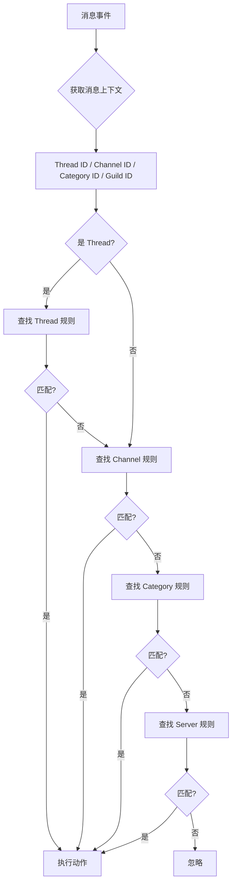

# 扫描监听提醒系统扩展计划：频道+分类支持

## 概述

将现有的"帖子自定义命令系统"扩展为支持**普通文字频道**和**频道分类（Category）**的完整消息监听系统。

---

## 一、扩展后的规则层级结构



### 规则优先级（从高到低）

| 优先级 | 范围 Scope | 说明 |
|--------|-----------|------|
| 1（最高） | `thread` | 帖子级规则，由贴主或管理员配置 |
| 2 | `channel` | 频道级规则，仅对该频道生效 |
| 3 | `category` | 分类级规则，对分类下所有频道生效 |
| 4（最低） | `server` | 全服规则，对所有频道/帖子生效 |

---

## 二、数据库变更

### 2.1 修改 `thread_command_rules` 表

在 [`core/database.py`](../core/database.py:609) 添加新字段：

```sql
-- 现有字段
scope TEXT NOT NULL,              -- 扩展为: 'server' | 'thread' | 'channel' | 'category'
thread_id TEXT,                   -- scope='thread' 时使用

-- 新增字段
channel_id TEXT,                  -- scope='channel' 时使用（普通文字频道ID）
category_id TEXT,                 -- scope='category' 时使用（分类频道ID）
```

### 2.2 新增索引

```sql
CREATE INDEX IF NOT EXISTS idx_tcr_channel ON thread_command_rules (channel_id);
CREATE INDEX IF NOT EXISTS idx_tcr_category ON thread_command_rules (category_id);
CREATE INDEX IF NOT EXISTS idx_tcr_full_lookup ON thread_command_rules (guild_id, scope, is_enabled, priority DESC);
```

### 2.3 数据库迁移代码

```python
# 在 _setup_database() 中添加
try:
    await conn.execute("ALTER TABLE thread_command_rules ADD COLUMN channel_id TEXT")
    logger.info("数据库迁移: 已为 thread_command_rules 添加列 channel_id")
except Exception:
    pass  # 已存在则忽略

try:
    await conn.execute("ALTER TABLE thread_command_rules ADD COLUMN category_id TEXT")
    logger.info("数据库迁移: 已为 thread_command_rules 添加列 category_id")
except Exception:
    pass  # 已存在则忽略

# 新增索引
await conn.execute("CREATE INDEX IF NOT EXISTS idx_tcr_channel ON thread_command_rules (channel_id)")
await conn.execute("CREATE INDEX IF NOT EXISTS idx_tcr_category ON thread_command_rules (category_id)")
```

---

## 三、模型变更

### 3.1 修改 [`ThreadCommandRule`](../core/models.py:434)

```python
@dataclass
class ThreadCommandRule:
    rule_id: Optional[int]
    guild_id: str
    scope: str                      # 扩展: 'server' | 'thread' | 'channel' | 'category'
    thread_id: Optional[str] = None
    channel_id: Optional[str] = None      # 新增
    category_id: Optional[str] = None     # 新增
    forum_channel_id: Optional[str] = None
    # ... 其余字段不变
```

### 3.2 更新 `from_row()` 方法

```python
@classmethod
def from_row(cls, row: Dict[str, Any], triggers: Optional[List[ThreadCommandTrigger]] = None) -> 'ThreadCommandRule':
    # ...
    return cls(
        # ...
        channel_id=str(row.get('channel_id')) if row.get('channel_id') else None,  # 新增
        category_id=str(row.get('category_id')) if row.get('category_id') else None,  # 新增
        # ...
    )
```

---

## 四、缓存系统扩展

### 4.1 修改 [`RuleCacheManager`](../cogs/thread_command.py:105)

```python
class RuleCacheManager:
    def __init__(self, db_manager):
        # 现有缓存
        self._server_rules: Dict[str, Tuple[List[ThreadCommandRule], float]] = {}
        self._thread_rules: Dict[str, Tuple[List[ThreadCommandRule], float]] = {}
        
        # 新增缓存
        self._channel_rules: Dict[str, Tuple[List[ThreadCommandRule], float]] = {}
        self._category_rules: Dict[str, Tuple[List[ThreadCommandRule], float]] = {}
        
        # 新增配置
        self.channel_rules_ttl = 1800   # 频道规则缓存30分钟
        self.category_rules_ttl = 3600  # 分类规则缓存1小时
        self.max_cached_channels = 100  # 最多缓存100个频道的规则
        self.max_cached_categories = 50 # 最多缓存50个分类的规则
```

### 4.2 新增缓存方法

```python
async def get_channel_rules(self, channel_id: str) -> List[ThreadCommandRule]:
    """获取频道规则，优先读缓存"""
    cached = self._channel_rules.get(channel_id)
    if cached and time.time() < cached[1]:
        return cached[0]
    
    rules = await self._load_channel_rules_from_db(channel_id)
    self._channel_rules[channel_id] = (rules, time.time() + self.channel_rules_ttl)
    self._enforce_cache_limits()
    return rules

async def get_category_rules(self, category_id: str) -> List[ThreadCommandRule]:
    """获取分类规则，优先读缓存"""
    cached = self._category_rules.get(category_id)
    if cached and time.time() < cached[1]:
        return cached[0]
    
    rules = await self._load_category_rules_from_db(category_id)
    self._category_rules[category_id] = (rules, time.time() + self.category_rules_ttl)
    self._enforce_cache_limits()
    return rules

async def _load_channel_rules_from_db(self, channel_id: str) -> List[ThreadCommandRule]:
    """从数据库加载频道规则"""
    rules_data = await self.db.fetchall(
        """SELECT * FROM thread_command_rules 
           WHERE channel_id = ? AND scope = 'channel' AND is_enabled = 1
           ORDER BY priority DESC""",
        (channel_id,)
    )
    # ... 同 _load_server_rules_from_db 类似

async def _load_category_rules_from_db(self, category_id: str) -> List[ThreadCommandRule]:
    """从数据库加载分类规则"""
    rules_data = await self.db.fetchall(
        """SELECT * FROM thread_command_rules 
           WHERE category_id = ? AND scope = 'category' AND is_enabled = 1
           ORDER BY priority DESC""",
        (category_id,)
    )
    # ... 同上
```

---

## 五、消息处理逻辑变更

### 5.1 修改 [`_process_message()`](../cogs/thread_command.py:545)

```python
async def _process_message(
    self,
    message: discord.Message,
    config: Optional[ThreadCommandServerConfig],
    is_scan: bool = False
):
    guild_id = str(message.guild.id)
    content = message.content.strip()
    matched_rule = None
    
    # 1. Thread 规则（最高优先级）
    if isinstance(message.channel, discord.Thread):
        thread_id = str(message.channel.id)
        thread_rules = await self.cache.get_thread_rules(thread_id)
        matched_rule = self._find_matching_rule(thread_rules, content)
    
    # 2. Channel 规则
    if not matched_rule:
        # 获取实际频道ID（Thread的父频道 或 当前频道）
        if isinstance(message.channel, discord.Thread):
            channel_id = str(message.channel.parent_id)
        else:
            channel_id = str(message.channel.id)
        
        channel_rules = await self.cache.get_channel_rules(channel_id)
        matched_rule = self._find_matching_rule(channel_rules, content)
    
    # 3. Category 规则
    if not matched_rule:
        category = message.channel.category
        if category:
            category_id = str(category.id)
            category_rules = await self.cache.get_category_rules(category_id)
            matched_rule = self._find_matching_rule(category_rules, content)
    
    # 4. Server 规则（最低优先级）
    if not matched_rule:
        server_rules = await self.cache.get_server_rules(guild_id)
        matched_rule = self._find_matching_rule(server_rules, content)
    
    if not matched_rule:
        return
    
    # 执行动作
    await self._execute_action(message, matched_rule, config, is_historical)

def _find_matching_rule(self, rules: List[ThreadCommandRule], content: str) -> Optional[ThreadCommandRule]:
    """在规则列表中查找第一个匹配的规则"""
    for rule in rules:
        if rule.match(content):
            return rule
    return None
```

---

## 六、命令结构变更

### 6.1 新增命令：`/扫描监听提醒 频道配置`

```python
@scan_cmd.command(name="频道配置", description="频道/分类规则配置（管理员）")
async def channel_config_panel(self, interaction: discord.Interaction):
    """频道/分类配置面板 - 管理员用"""
    if not await self.check_server_config_permission(interaction):
        await interaction.response.send_message("❌ 权限不足", ephemeral=True)
        return
    
    guild_id = str(interaction.guild.id)
    
    # 构建面板
    embed = discord.Embed(
        title="📺 扫描监听提醒 - 频道/分类配置",
        description="选择要配置的目标类型",
        color=0x9b59b6
    )
    
    view = ChannelConfigPanelView(self, guild_id)
    await interaction.response.send_message(embed=embed, view=view, ephemeral=True)
```

### 6.2 完整命令列表（4个命令）

| 命令 | 用途 | 权限 |
|------|------|------|
| `/扫描监听提醒 状态` | 查看系统状态和统计 | 所有人 |
| `/扫描监听提醒 配置` | 全服规则管理 + 系统开关 | 管理员/特殊身份组 |
| `/扫描监听提醒 帖子配置` | 帖子规则管理 | 贴主/管理员 |
| `/扫描监听提醒 频道配置` | **频道/分类规则管理** | 管理员/特殊身份组 |

---

## 七、新增视图组件

### 7.1 频道配置面板视图

```python
class ChannelConfigPanelView(discord.ui.View):
    """频道配置面板视图"""
    
    def __init__(self, cog: ThreadCommandCog, guild_id: str):
        super().__init__(timeout=300)
        self.cog = cog
        self.guild_id = guild_id
        self.target_type = 'channel'  # 'channel' 或 'category'
        self.selected_target_id = None
    
    @discord.ui.button(label="🔹 单个频道", style=discord.ButtonStyle.primary, row=0)
    async def select_channel(self, interaction: discord.Interaction, button: discord.ui.Button):
        self.target_type = 'channel'
        # 显示频道选择器
        view = ChannelSelectView(self.cog, self.guild_id, 'channel')
        await interaction.response.send_message(
            "请选择要配置的频道：",
            view=view,
            ephemeral=True
        )
    
    @discord.ui.button(label="📁 整个分类", style=discord.ButtonStyle.secondary, row=0)
    async def select_category(self, interaction: discord.Interaction, button: discord.ui.Button):
        self.target_type = 'category'
        # 显示分类选择器
        view = CategorySelectView(self.cog, self.guild_id)
        await interaction.response.send_message(
            "请选择要配置的分类：",
            view=view,
            ephemeral=True
        )
```

### 7.2 频道选择器视图

```python
class ChannelSelectView(discord.ui.View):
    """频道选择器"""
    
    def __init__(self, cog: ThreadCommandCog, guild_id: str, target_type: str):
        super().__init__(timeout=120)
        self.cog = cog
        self.guild_id = guild_id
        self.target_type = target_type
        
        # 动态构建频道选择器
        self.channel_select = discord.ui.ChannelSelect(
            placeholder="选择频道...",
            channel_types=[discord.ChannelType.text, discord.ChannelType.news],
            min_values=1,
            max_values=1
        )
        self.channel_select.callback = self.on_channel_select
        self.add_item(self.channel_select)
    
    async def on_channel_select(self, interaction: discord.Interaction):
        channel = self.channel_select.values[0]
        # 显示该频道的规则管理面板
        view = ChannelRuleManageView(self.cog, self.guild_id, str(channel.id), 'channel')
        await interaction.response.edit_message(
            content=f"📺 频道 {channel.mention} 的规则配置",
            view=view
        )
```

### 7.3 分类选择器视图

```python
class CategorySelectView(discord.ui.View):
    """分类选择器"""
    
    def __init__(self, cog: ThreadCommandCog, guild_id: str):
        super().__init__(timeout=120)
        self.cog = cog
        self.guild_id = guild_id
        
        # 动态构建分类选择器
        self.category_select = discord.ui.ChannelSelect(
            placeholder="选择分类...",
            channel_types=[discord.ChannelType.category],
            min_values=1,
            max_values=1
        )
        self.category_select.callback = self.on_category_select
        self.add_item(self.category_select)
    
    async def on_category_select(self, interaction: discord.Interaction):
        category = self.category_select.values[0]
        
        # 显示分类信息
        channels_in_category = [c for c in category.channels if isinstance(c, discord.TextChannel)]
        
        embed = discord.Embed(
            title=f"📁 分类: {category.name}",
            description=f"此分类下有 {len(channels_in_category)} 个文字频道",
            color=0x9b59b6
        )
        
        if channels_in_category:
            channel_list = '\n'.join([f"• {c.mention}" for c in channels_in_category[:10]])
            if len(channels_in_category) > 10:
                channel_list += f"\n... +{len(channels_in_category) - 10} 个频道"
            embed.add_field(name="包含的频道", value=channel_list, inline=False)
        
        view = ChannelRuleManageView(self.cog, self.guild_id, str(category.id), 'category')
        await interaction.response.edit_message(embed=embed, view=view)
```

---

## 八、常量和配置更新

### 8.1 更新范围映射

```python
# 在 thread_command.py 中
SCOPE_DISPLAY = {
    'server': '全服',
    'thread': '帖子',
    'channel': '频道',     # 新增
    'category': '分类',    # 新增
}
```

### 8.2 更新缓存配置

```python
CACHE_CONFIG = {
    'server_rules_ttl': 3600,
    'thread_rules_ttl': 1800,
    'channel_rules_ttl': 1800,   # 新增
    'category_rules_ttl': 3600,  # 新增
    'server_config_ttl': 3600,
    'max_cached_threads': 200,
    'max_cached_guilds': 10,
    'max_cached_channels': 100,  # 新增
    'max_cached_categories': 50, # 新增
}
```

---

## 九、状态命令更新

更新 `/扫描监听提醒 状态` 命令以显示频道/分类规则统计：

```python
# 查询各类规则数量
server_rules_count = await self.db.fetchone(
    "SELECT COUNT(*) as cnt FROM thread_command_rules WHERE guild_id = ? AND scope = 'server'",
    (guild_id,)
)
channel_rules_count = await self.db.fetchone(
    "SELECT COUNT(*) as cnt FROM thread_command_rules WHERE guild_id = ? AND scope = 'channel'",
    (guild_id,)
)
category_rules_count = await self.db.fetchone(
    "SELECT COUNT(*) as cnt FROM thread_command_rules WHERE guild_id = ? AND scope = 'category'",
    (guild_id,)
)

embed.add_field(
    name="📊 规则统计",
    value=f"全服: {server_rules_count['cnt']} | 频道: {channel_rules_count['cnt']} | 分类: {category_rules_count['cnt']}",
    inline=False
)
```

---

## 十、辅助方法扩展

### 10.1 新增 `add_channel_rule()` 方法

```python
async def add_channel_rule(
    self,
    guild_id: str,
    target_id: str,
    target_type: str,  # 'channel' 或 'category'
    trigger_list: list,
    trigger_mode: str,
    action_type: str,
    reply_content: Optional[str],
    delete_delay: Optional[int],
    user_id: str
) -> int:
    """添加频道/分类规则"""
    now = datetime.utcnow().isoformat()
    scope = target_type  # 'channel' 或 'category'
    
    # 根据类型设置对应字段
    channel_id = target_id if target_type == 'channel' else None
    category_id = target_id if target_type == 'category' else None
    
    await self.db.execute(
        """INSERT INTO thread_command_rules
           (guild_id, scope, channel_id, category_id, action_type, reply_content,
            delete_trigger_delay, delete_reply_delay, is_enabled, priority,
            created_by, created_at, updated_at)
           VALUES (?, ?, ?, ?, ?, ?, ?, ?, 1, 0, ?, ?, ?)""",
        (
            guild_id, scope, channel_id, category_id, action_type, reply_content,
            delete_delay, delete_delay, user_id, now, now
        )
    )
    
    # 获取新创建的规则ID
    rule_row = await self.db.fetchone(
        "SELECT rule_id FROM thread_command_rules WHERE guild_id = ? ORDER BY rule_id DESC LIMIT 1",
        (guild_id,)
    )
    rule_id = rule_row['rule_id']
    
    # 添加触发器
    for t in trigger_list:
        await self.db.execute(
            """INSERT INTO thread_command_triggers
               (rule_id, trigger_text, trigger_mode, is_enabled, created_at)
               VALUES (?, ?, ?, 1, ?)""",
            (rule_id, t, trigger_mode, now)
        )
    
    # 刷新缓存
    if target_type == 'channel':
        await self.cache.refresh_channel_rules(target_id)
    else:
        await self.cache.refresh_category_rules(target_id)
    
    return rule_id
```

---

## 十一、实施步骤

### 第一阶段：数据库和模型（基础设施）
1. 修改 [`core/database.py`](../core/database.py) - 添加新字段和索引
2. 修改 [`core/models.py`](../core/models.py) - 扩展 `ThreadCommandRule` 模型

### 第二阶段：缓存系统
3. 修改 [`cogs/thread_command.py`](../cogs/thread_command.py) 中的 `RuleCacheManager`
   - 添加 `_channel_rules` 和 `_category_rules` 缓存
   - 添加 `get_channel_rules()` 和 `get_category_rules()` 方法
   - 添加对应的数据库加载方法

### 第三阶段：消息处理逻辑
4. 修改 `_process_message()` 方法
   - 添加频道规则查找
   - 添加分类规则查找
   - 实现规则优先级逻辑

### 第四阶段：新增命令和视图
5. 添加 `/扫描监听提醒 频道配置` 命令
6. 创建新的视图组件：
   - `ChannelConfigPanelView`
   - `ChannelSelectView`
   - `CategorySelectView`
   - `ChannelRuleManageView`

### 第五阶段：更新现有功能
7. 更新 `/扫描监听提醒 状态` 显示频道/分类规则统计
8. 更新常量和配置
9. 添加辅助方法

### 第六阶段：测试和文档
10. 测试所有新功能
11. 更新设计文档

---

## 十二、文件变更清单

| 文件 | 变更类型 | 说明 |
|------|---------|------|
| [`core/database.py`](../core/database.py:609) | 修改 | 添加 `channel_id`, `category_id` 字段和索引，数据库迁移代码 |
| [`core/models.py`](../core/models.py:434) | 修改 | `ThreadCommandRule` 添加新字段，更新 `from_row()` |
| [`cogs/thread_command.py`](../cogs/thread_command.py) | 修改 | 缓存系统、消息处理、新命令、辅助方法 |
| [`views/thread_command_views.py`](../views/thread_command_views.py) | 可选 | 如需拆分视图组件 |
| [`docs/thread_command_design.md`](../docs/thread_command_design.md) | 更新 | 文档更新 |

---

## 十三、向后兼容性

- ✅ 现有规则（`server` 和 `thread` scope）完全兼容
- ✅ 新增字段 `channel_id` 和 `category_id` 默认为 NULL
- ✅ 不影响现有配置面板功能
- ✅ 权限模型无需修改（复用现有 `check_server_config_permission`）

---

## 十四、风险和注意事项

1. **缓存容量**：新增两种缓存类型，需要监控内存使用
2. **查询性能**：规则匹配增加了两层查询，需要确保索引有效
3. **用户体验**：频道选择器可能在大服务器中显示过多频道，考虑分页或搜索
4. **规则冲突**：不同层级的规则可能产生意外行为，需要在文档中说明优先级

---

*文档创建日期: 2024-12-21*
*状态: 待用户确认*